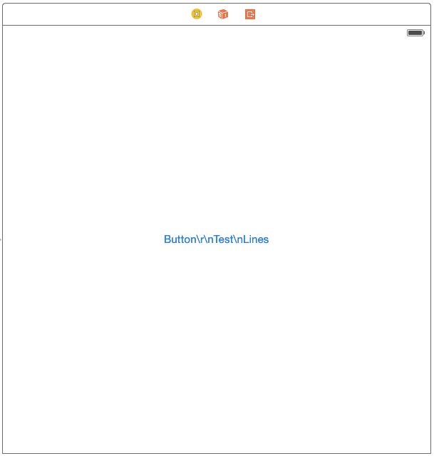
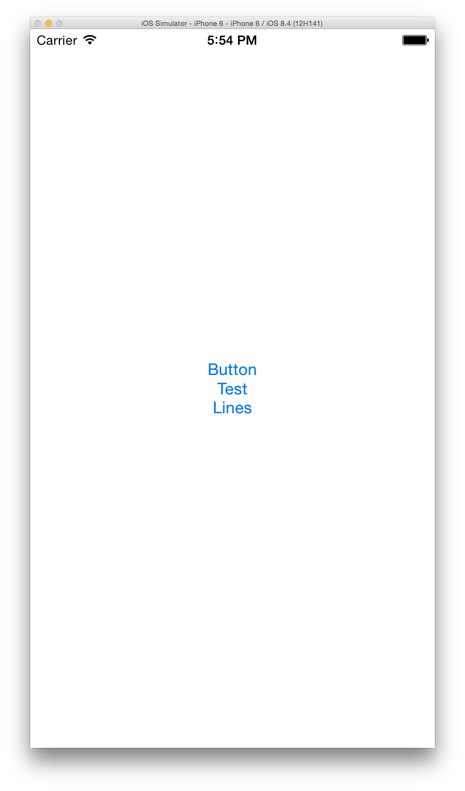

# UIButton-XibLinesText
自动转换UIButton在Xib设置Title时输入的换行符

<p align="center" >


</p>

## Import
[CocoaPods](http://cocoapods.org)

`pod 'UIButton-XibLinesText', '~> 1.0.1'`

## Usage
若只设置了UIControlStateNormal的Title或其它State的Title与UIControlStateNormal不同直接import即可
```objective-c

#import "UIButton+VDXibLinesText.h"

```

若有其它State的Title和UIControlStateNormal相同需手动设置，因无法确定是否要为该State重新设值，若非UIControlStateNormal的值为nil默认会返回UIControlStateNormal的Title
```objective-c

#import "UIButton+VDXibLinesText.h"

self.testButton.vd_xibLinesTextState = UIControlStateHighlighted | UIControlStateDisabled;

```

## License

[MIT license](LICENSE)
